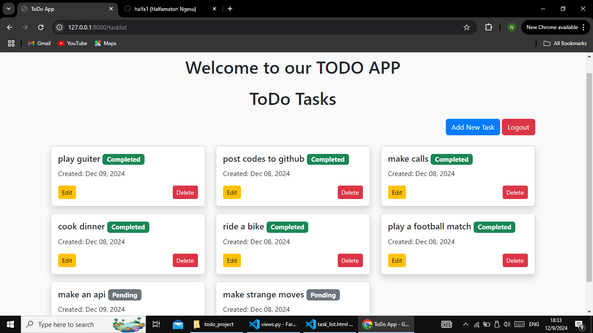
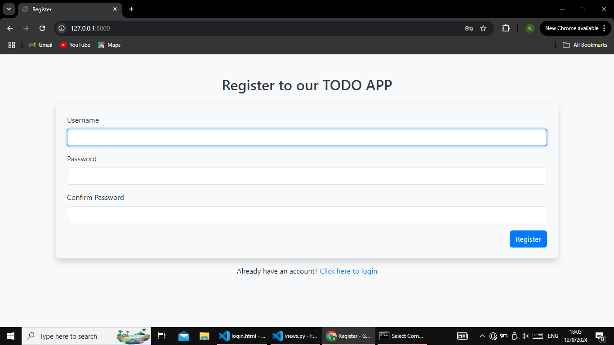

# ToDo App

_A simple and user-friendly To-Do application for task management._

## **Project Description**

This Django-based To-Do application allows users to manage their daily tasks efficiently. The app is structured into three separate Django apps:

1. **Accounts App**: Manages user authentication and registration. Includes login, logout, and sign-up functionalities.
2. **To-Do App**: Handles task management, including creating, updating, deleting, and viewing tasks.
3. **API App**: Provides a RESTful API for integrating the To-Do app with other services or client-side applications.

The application is built using **Django**, **Bootstrap & django-widget-tweaks** for styling, and optional **Django REST Framework** for the API.

---

## **Features**

- User authentication (registration, login, logout).
- Add, edit, delete, and view tasks.
- Responsive design using Bootstrap.
- Optional API for programmatic interaction with tasks.

---

## **Screenshots**

### Login Page


### Task Listing Page



### Register page



---

## **How to Run This App Locally**

Follow these steps to set up and run the To-Do app on your local machine:

### **Prerequisites**

- Python 3.8 or later.
- Virtual environment tool (e.g., `venv` or `virtualenv`).
- Git (optional, for cloning the repository).

### **Setup Instructions**

1. **Clone the Repository**:

   ```bash
   git clone https://github.com/halfa1/TODO-APP.git
   cd todo_project

   ```

2. **create and activate a virtual environment**
   On windows:
   python -m venv venv
   .\venv\Scripts\activate

   On macOS/Linux:
   python3 -m venv venv
   source venv/bin/activate

3. **Install Dependencies**
   pip install -r requirements.txt

4. **Run Database Migrations**
   python manage.py makemigrations
   python manage.py migrate

5. **Create a super user(optional)**
   python manage.py createsuperuser

6. **Run the Development Server**
   python manage.py runserver

7. **Access the Application:**
   http://127.0.0.1:8000

### **For the apis:**

    /api/tasks/    ---GET ---- List all tasks.
    /api/tasks/create/	---POST ---	Create a new task.
    /api/tasks/<id>/delete/	----DELETE---	Delete a task.

### **Contributing**

Feel free to fork this project and submit a pull request if you want to contribute.

### **License**

This project is was developed by Halfamaton Ngesu 2024.
